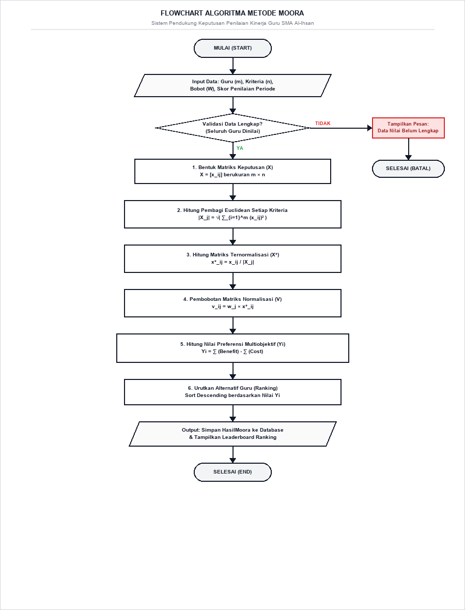

# BAB IV: HASIL DAN PEMBAHASAN
## 4.3 Pseudocode / Flowchart Algoritma MOORA

Penerapan metode MOORA pada Sistem Pendukung Keputusan Penilaian Kinerja Guru di SMA Al-Ihsan Boarding School dirancang ke dalam diagram alir (Flowchart) dan notasi algoritma terstruktur (Pseudocode).

### 4.3.1 Flowchart Algoritma MOORA



**Gambar 4.1. Flowchart Proses Komputasi Algoritma Metode MOORA**

#### Uraian Langkah Alur Flowchart:
1. **Mulai (Start)**: Sistem menginisialisasi sesi eksekusi perhitungan periode aktif.
2. **Input Data**: Mengambil data master guru ($m$), kriteria ($n$), bobot preferensi ($W$), dan skor penilaian.
3. **Validasi Kelengkapan Nilai**: Memeriksa apakah seluruh guru telah dinilai lengkap. Jika tidak, proses dibatalkan.
4. **Pembentukan Matriks Keputusan ($X$)**: Menyusun matriks nilai $X = [x_{ij}]_{m \times n}$.
5. **Perhitungan Pembagi Normalisasi**: Menghitung penyebut Euclidean $|X_j| = \sqrt{\sum_{i=1}^m (x_{ij})^2}$.
6. **Normalisasi Matriks ($X^*$)**: Menghitung rasio vektor $x^*_{ij} = \frac{x_{ij}}{|X_j|}$.
7. **Pembobotan Matriks ($V$)**: Menghitung matriks terbobot $v_{ij} = w_j \times x^*_{ij}$.
8. **Perhitungan Nilai Preferensi ($Y_i$)**: Menghitung $Y_i = \sum \text{Benefit} - \sum \text{Cost}$.
9. **Perankingan Alternatif**: Mengurutkan nilai $Y_i$ secara *descending* (terbesar ke terkecil).
10. **Penyimpanan & Output**: Menyimpan hasil ke database (`HasilMoora`) dan menampilkan leaderboard.
11. **Selesai (End)**: Eksekusi SPK MOORA selesai.

---

### 4.3.2 Pseudocode Algoritma MOORA

```pascal
ALGORITMA Perhitungan_Metode_MOORA

MASUKAN (INPUT):
  - Data Guru Alternatif (A1, A2, ..., Am)
  - Data Kriteria Penilaian (C1, C2, ..., Cn)
  - Bobot Preferensi Kriteria (w1, w2, ..., wn)
  - Sifat Atribut Kriteria (Benefit / Cost)
  - Nilai Skor Evaluasi Kinerja Guru pada Periode Aktif

KELUARAN (OUTPUT):
  - Nilai Preferensi Multiobjektif (Yi) Setiap Guru
  - Daftar Urutan Peringkat / Ranking Kinerja Guru

LANGKAH-LANGKAH PROSEDURAL:
1.   MULAI
2.   Baca Data Guru (m), Kriteria (n), Bobot Kriteria (W), dan Skor Penilaian
3.   
4.   // Tahap 1: Validasi Kelengkapan Nilai
5.   Periksa apakah semua guru telah memiliki nilai lengkap pada seluruh kriteria
6.   JIKA data nilai belum lengkap MAKA
7.       Tampilkan pesan 'Data penilaian guru belum lengkap'
8.       Hentikan proses dan KELUAR
9.   AKHIR-JIKA
10.  
11.  // Tahap 2: Pembentukan Matriks Keputusan (X)
12.  UNTUK setiap guru (i = 1 sampai m) LAKUKAN
13.      UNTUK setiap kriteria (j = 1 sampai n) LAKUKAN
14.          X[i][j] <- Nilai skor evaluasi guru ke-i pada kriteria ke-j
15.      AKHIR-UNTUK
16.  AKHIR-UNTUK
17.  
18.  // Tahap 3: Hitung Pembagi Normalisasi Vektor Euclidean
19.  UNTUK setiap kriteria (j = 1 sampai n) LAKUKAN
20.      TotalKuadrat <- 0
21.      UNTUK setiap guru (i = 1 sampai m) LAKUKAN
22.          TotalKuadrat <- TotalKuadrat + (X[i][j])^2
23.      AKHIR-UNTUK
24.      Pembagi[j] <- AKAR_KUADRAT(TotalKuadrat)
25.  AKHIR-UNTUK
26.  
27.  // Tahap 4: Normalisasi dan Pembobotan Matriks
28.  UNTUK setiap guru (i = 1 sampai m) LAKUKAN
29.      UNTUK setiap kriteria (j = 1 sampai n) LAKUKAN
30.          // Normalisasi nilai: x*_ij = x_ij / Pembagi_j
31.          X_Normalisasi[i][j] <- X[i][j] / Pembagi[j]
32.          // Pembobotan nilai: v_ij = Bobot_j * x*_ij
33.          V[i][j] <- Bobot[j] * X_Normalisasi[i][j]
34.      AKHIR-UNTUK
35.  AKHIR-UNTUK
36.  
37.  // Tahap 5: Perhitungan Nilai Preferensi Multiobjektif (Yi)
38.  UNTUK setiap guru (i = 1 sampai m) LAKUKAN
39.      TotalBenefit <- 0
40.      TotalCost    <- 0
41.      UNTUK setiap kriteria (j = 1 sampai n) LAKUKAN
42.          JIKA Kriteria[j] adalah BENEFIT MAKA
43.              TotalBenefit <- TotalBenefit + V[i][j]
44.          JIKA_TIDAK
45.              TotalCost    <- TotalCost + V[i][j]
46.          AKHIR-JIKA
47.      AKHIR-UNTUK
48.      // Nilai Yi = Total Benefit - Total Cost
49.      NilaiPreferensi[i] <- TotalBenefit - TotalCost
50.  AKHIR-UNTUK
51.  
52.  // Tahap 6: Penentuan Ranking / Urutan Peringkat
53.  Urutkan daftar guru berdasarkan NilaiPreferensi secara MENURUN (terbesar ke terkecil)
54.  UNTUK setiap peringkat (k = 1 sampai m) LAKUKAN
55.      GuruTerurut[k].Ranking <- k
56.  AKHIR-UNTUK
57.  
58.  // Tahap 7: Penyimpanan dan Penampilan Hasil
59.  Simpan hasil perhitungan Nilai Preferensi dan Ranking ke dalam basis data
60.  Tampilkan tabel hasil perankingan kinerja guru
61.  SELESAI
```

---

### 4.3.3 Analisis Efisiensi dan Kompleksitas Algoritma MOORA

- **Kompleksitas Waktu (Time Complexity)**: $\mathcal{O}(m \times n + m \log m)$, di mana $m$ adalah jumlah alternatif guru dan $n$ adalah jumlah kriteria. Waktu eksekusi sangat cepat ($< 0.05$ detik).
- **Kompleksitas Ruang (Space Complexity)**: $\mathcal{O}(m \times n)$, sangat hemat alokasi memori server.
