# BAB IV: HASIL DAN PEMBAHASAN
## 4.4 Perancangan Antarmuka Pengguna (User Interface Design)

Perancangan antarmuka pengguna pada Sistem Pendukung Keputusan (SPK) Penilaian Kinerja Guru Metode MOORA SMA Al-Ihsan Boarding School disusun dalam bentuk rancangan wireframe monokromatik (polos perancangan) yang identik dengan sistem aktual:

### 4.4.1 Rancangan Antarmuka Halaman Login

Halaman Login berfungsi sebagai gerbang autentikasi dan otorisasi terpusat (multilevel login) bagi seluruh aktor pengguna sistem (Administrator, Kepala Sekolah, dan Guru) untuk memvalidasi kredensial username dan password sebelum mengakses hak fitur masing-masing. **Hak Akses**: `Administrator, Kepala Sekolah, Guru`.

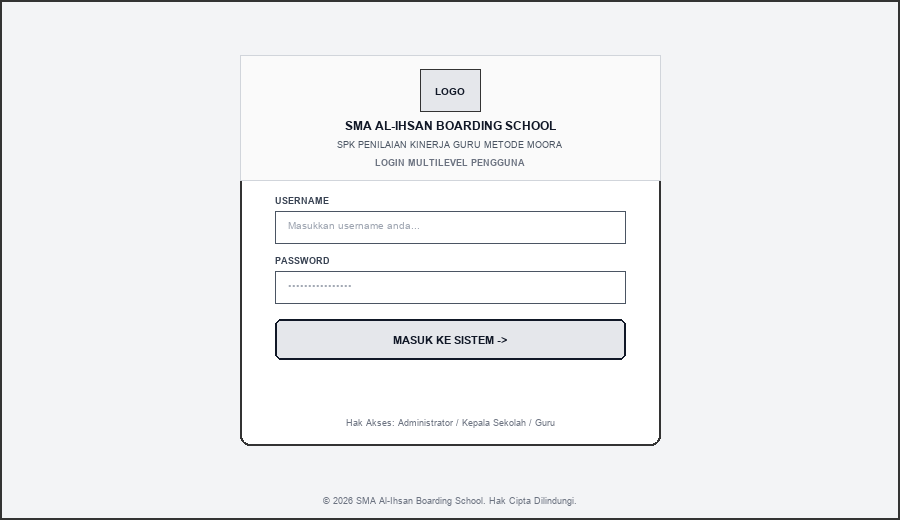

**Gambar 4.1. Rancangan Antarmuka Halaman Login**

| No | Nama Kontrol / Komponen | Tipe Kontrol | Fungsi / Keterangan |
| :---: | :--- | :---: | :--- |
| 1 | **Logo Al-Ihsan** | `Image / Brand` | Menampilkan identitas resmi SMA Al-Ihsan Boarding School |
| 2 | **Field Username** | `Input Text` | Menerima input username unik akun pengguna terdaftar |
| 3 | **Field Password** | `Input Password` | Menerima input password terenkripsi pengguna |
| 4 | **Tombol Masuk ke Sistem** | `Button` | Mengeksekusi proses verifikasi kredensial autentikasi login |

---

### 4.4.2 Rancangan Antarmuka Dashboard Administrator

Halaman Dashboard Administrator berfungsi sebagai pusat kendali utama yang menampilkan ringkasan data statistik sistem secara real-time, status progres kelengkapan penilaian kriteria guru pada periode berjalan, peringkat 3 besar guru terbaik, serta rekaman log aktivitas terbaru. **Hak Akses**: `Administrator`.

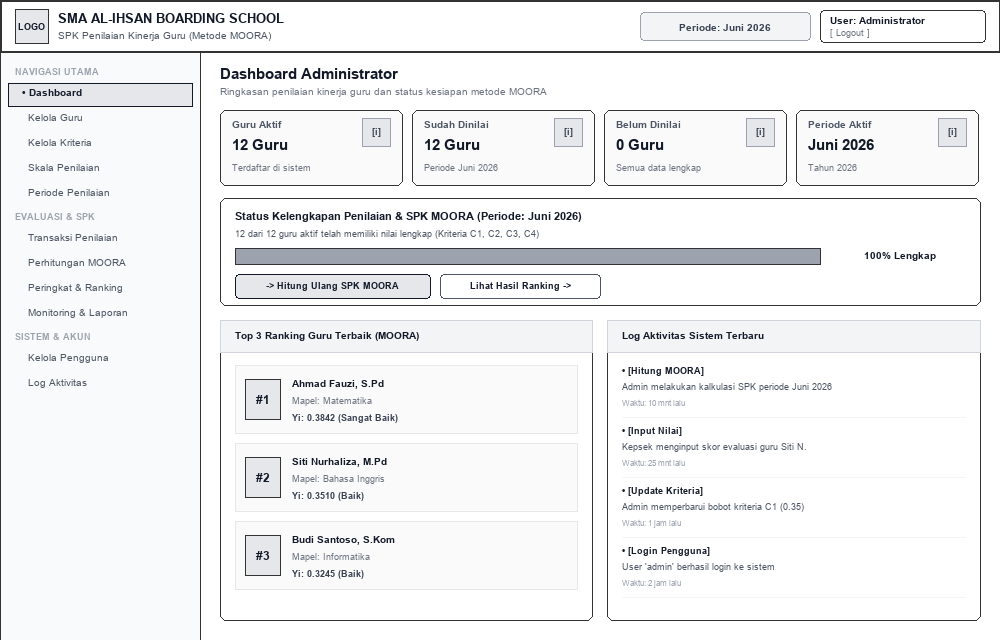

**Gambar 4.2. Rancangan Antarmuka Dashboard Administrator**

| No | Nama Kontrol / Komponen | Tipe Kontrol | Fungsi / Keterangan |
| :---: | :--- | :---: | :--- |
| 1 | **Sidebar Navigasi** | `Navigation Menu` | Menu peralihan antar modul data master, penilaian, SPK MOORA, dan laporan |
| 2 | **4 Kartu Statistik** | `Info Card Widget` | Menampilkan total Guru Aktif, Sudah Dinilai, Belum Dinilai, dan Periode Aktif |
| 3 | **Status Kelengkapan Penilaian** | `Progress Bar & Alert` | Menampilkan persentase kesiapan data nilai guru untuk kalkulasi MOORA |
| 4 | **Tombol Hitung MOORA** | `Action Button` | Akses pintas langsung untuk menjalankan kalkulasi optimasi MOORA |
| 5 | **Top 3 Leaderboard Guru** | `List Widget` | Menampilkan 3 guru dengan nilai preferensi Yi tertinggi |
| 6 | **Log Aktivitas Terbaru** | `Audit Trail List` | Menampilkan 5 riwayat aktivitas manipulasi data sistem terbaru |

---

### 4.4.3 Rancangan Antarmuka Kelola Data Guru

Halaman Kelola Data Guru berfungsi untuk mengelola seluruh data master guru SMA Al-Ihsan Boarding School yang menjadi objek alternatif penilaian kinerja, meliputi identitas NIP, jenis kelamin, tugas mengajar, jumlah jam tatap muka, dan rombongan belajar. **Hak Akses**: `Administrator`.

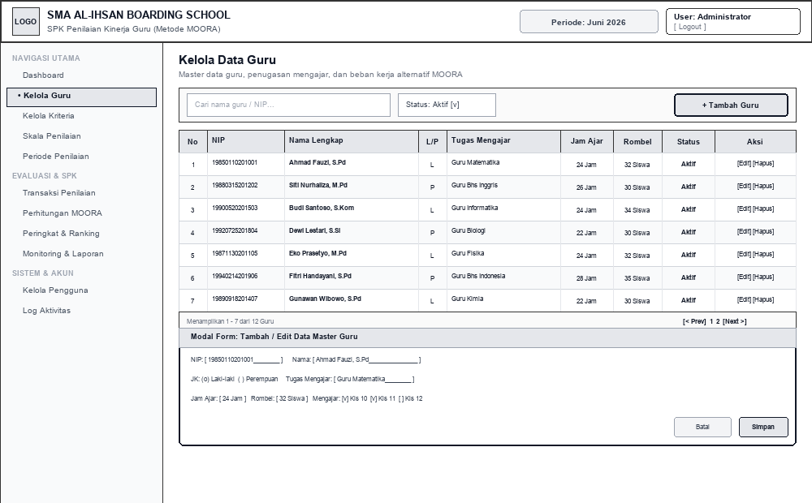

**Gambar 4.3. Rancangan Antarmuka Kelola Data Guru**

| No | Nama Kontrol / Komponen | Tipe Kontrol | Fungsi / Keterangan |
| :---: | :--- | :---: | :--- |
| 1 | **Pencarian & Filter Status** | `Input Search & Dropdown` | Menyaring daftar guru berdasarkan kata kunci nama/NIP dan status aktif |
| 2 | **Tombol + Tambah Guru** | `Primary Button` | Membuka modal dialog form pendaftaran data master guru baru |
| 3 | **Tabel Data Guru** | `Data Table Grid` | Menampilkan kolom No, NIP, Nama, JK, Tugas Mengajar, Jam Ajar, Rombel, Status |
| 4 | **Tombol Aksi [Edit] & [Hapus]** | `Action Links` | Melakukan pengeditan data guru atau menghapus data alternatif |
| 5 | **Modal Form Input Guru** | `Modal Dialog Form` | Form isian NIP, nama lengkap, penugasan mengajar, jam ajar, dan rombel |

---

### 4.4.4 Rancangan Antarmuka Kelola Kriteria & Bobot

Halaman Kelola Kriteria berfungsi untuk mengatur data kriteria evaluasi kinerja guru (C1-Pedagogik, C2-Profesional, C3-Kepribadian, C4-Sosial), menetapkan nilai bobot preferensi (total 1.00 / 100%), dan menentukan jenis sifat kriteria metode MOORA (Benefit atau Cost). **Hak Akses**: `Administrator`.

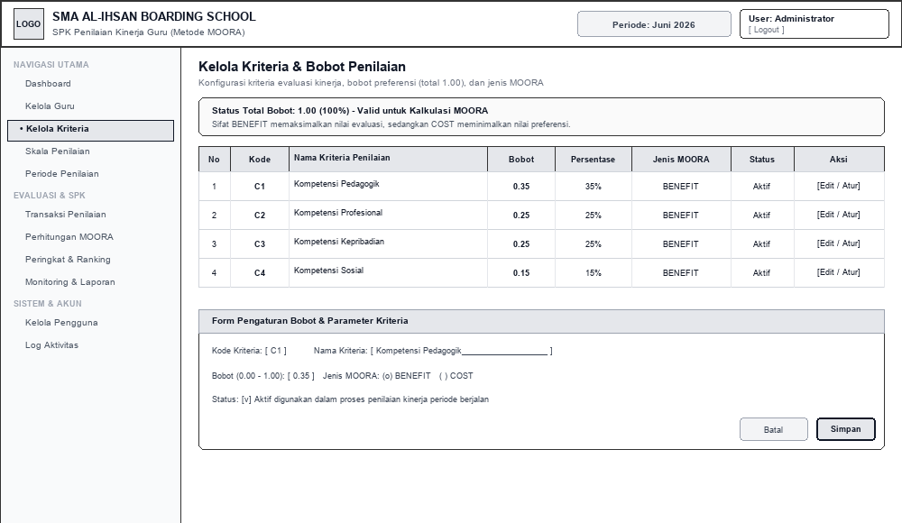

**Gambar 4.4. Rancangan Antarmuka Kelola Kriteria & Bobot**

| No | Nama Kontrol / Komponen | Tipe Kontrol | Fungsi / Keterangan |
| :---: | :--- | :---: | :--- |
| 1 | **Banner Status Total Bobot** | `Alert Info Box` | Memvalidasi apakah akumulasi seluruh bobot kriteria telah genap bernilai 1.00 |
| 2 | **Tabel Kriteria Penilaian** | `Data Table Grid` | Menampilkan Kode (C1-C4), Nama Kriteria, Nilai Bobot, Persentase, Sifat MOORA |
| 3 | **Tombol Aksi [Edit / Atur]** | `Action Button` | Membuka form penyesuaian bobot preferensi kriteria |
| 4 | **Form Modal Bobot Kriteria** | `Form Input Container` | Form pengaturan kode kriteria, nama, nilai bobot numerik, dan jenis Benefit/Cost |

---

### 4.4.5 Rancangan Antarmuka Kelola Skala Penilaian / Rubrik

Halaman Kelola Skala Penilaian berfungsi untuk mengelola rubrik sub-kriteria dan pedoman indikator skor kuantitatif (skala 1 sampai 5) dari masing-masing kriteria penilaian agar proses evaluasi guru berjalan objektif dan terstandarisasi. **Hak Akses**: `Administrator`.

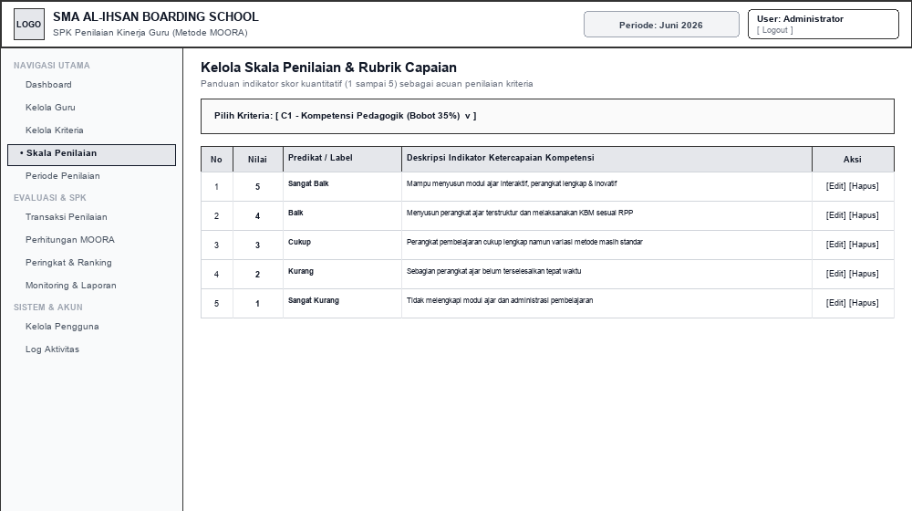

**Gambar 4.5. Rancangan Antarmuka Kelola Skala Penilaian / Rubrik**

| No | Nama Kontrol / Komponen | Tipe Kontrol | Fungsi / Keterangan |
| :---: | :--- | :---: | :--- |
| 1 | **Dropdown Pilihan Kriteria** | `Select Dropdown` | Memilih kriteria spesifik yang akan dikonfigurasi skala rubriknya |
| 2 | **Tabel Rubrik Penilaian** | `Data Table Grid` | Menampilkan tingkatan Nilai (1-5), Label Predikat, dan Deskripsi Indikator Capaian |
| 3 | **Tombol [Edit] & [Hapus]** | `Action Links` | Memodifikasi uraian kalimat indikator ketercapaian rubrik kompetensi |

---

### 4.4.6 Rancangan Antarmuka Kelola Periode Penilaian

Halaman Kelola Periode Penilaian berfungsi untuk membuka dan menutup gelombang evaluasi kinerja guru secara berkala (bulanan/semesteran), mengatur periode berstatus AKTIF, serta mengarsipkan riwayat periode yang telah SELESAI. **Hak Akses**: `Administrator`.

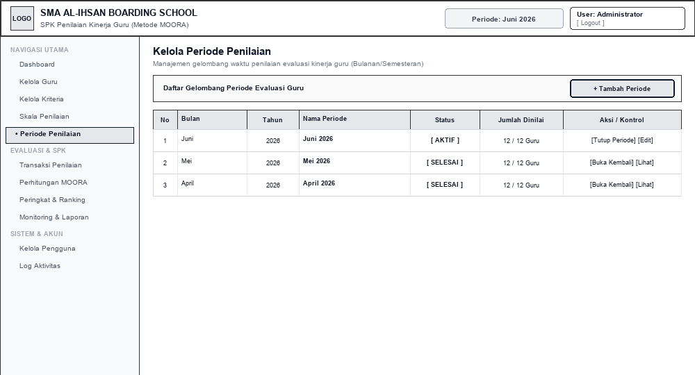

**Gambar 4.6. Rancangan Antarmuka Kelola Periode Penilaian**

| No | Nama Kontrol / Komponen | Tipe Kontrol | Fungsi / Keterangan |
| :---: | :--- | :---: | :--- |
| 1 | **Tombol + Tambah Periode** | `Primary Button` | Membuka form pembuatan periode evaluasi baru (Bulan, Tahun, Nama Periode) |
| 2 | **Tabel Periode Penilaian** | `Data Table Grid` | Menampilkan Nama Periode, Tahun, Status (DRAFT/AKTIF/SELESAI), Progres Dinilai |
| 3 | **Tombol [Tutup / Buka Periode]** | `Status Toggle Button` | Mengubah status operasional periode penilaian agar data terkunci aman |

---

### 4.4.7 Rancangan Antarmuka Form Transaksi Penilaian Kinerja Guru

Halaman Form Penilaian berfungsi sebagai antarmuka pengisian skor evaluasi kinerja setiap guru pada periode aktif, di mana evaluator menginput nilai kuantitatif untuk kriteria Pedagogik, Profesional, Kepribadian, dan Sosial disertai catatan rekomendasi. **Hak Akses**: `Kepala Sekolah, Administrator`.

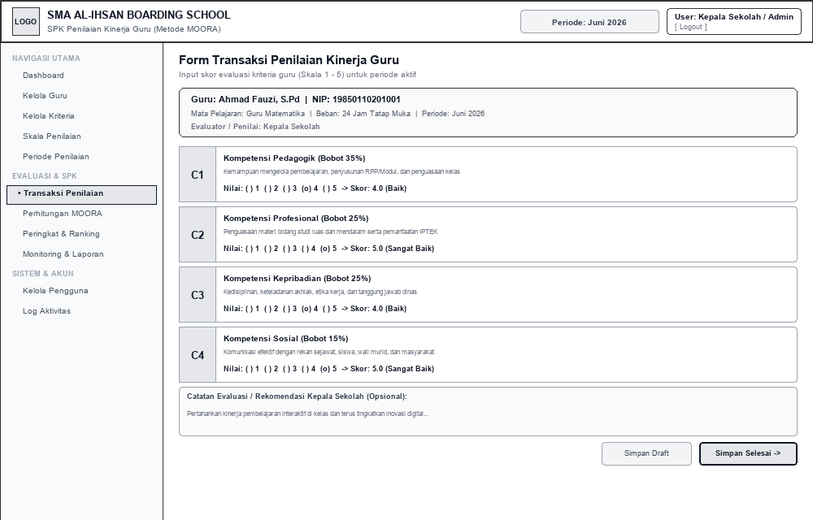

**Gambar 4.7. Rancangan Antarmuka Form Transaksi Penilaian Kinerja Guru**

| No | Nama Kontrol / Komponen | Tipe Kontrol | Fungsi / Keterangan |
| :---: | :--- | :---: | :--- |
| 1 | **Informasi Profil Guru** | `Header Profile Card` | Menampilkan NIP, Nama Guru, Mata Pelajaran, Beban Jam Ajar, dan Nama Evaluator |
| 2 | **Kartu Input Skor Kriteria (C1-C4)** | `Radio Group / Scale` | Pilihan opsi skala nilai (1-5) dengan label keterangan ketercapaian |
| 3 | **Field Catatan Evaluator** | `Textarea Multi-line` | Menerima input catatan kualitatif, saran pengembangan, atau apresiasi penilai |
| 4 | **Tombol [Simpan Draft]** | `Secondary Button` | Menyimpan nilai sementara tanpa memvalidasi kelengkapan final |
| 5 | **Tombol [Simpan Selesai]** | `Primary Button` | Menyimpan nilai evaluasi final dan memperbarui status menjadi SELESAI |

---

### 4.4.8 Rancangan Antarmuka Proses Perhitungan SPK MOORA

Halaman Perhitungan MOORA berfungsi untuk mengeksekusi algoritma SPK MOORA secara transparan melalui tahapan pembentukan Matriks Keputusan (X), Matriks Ternormalisasi (X*), Matriks Terbobot (W*X*), hingga kalkulasi Nilai Preferensi Optimasi Multiobjektif (Yi). **Hak Akses**: `Administrator`.

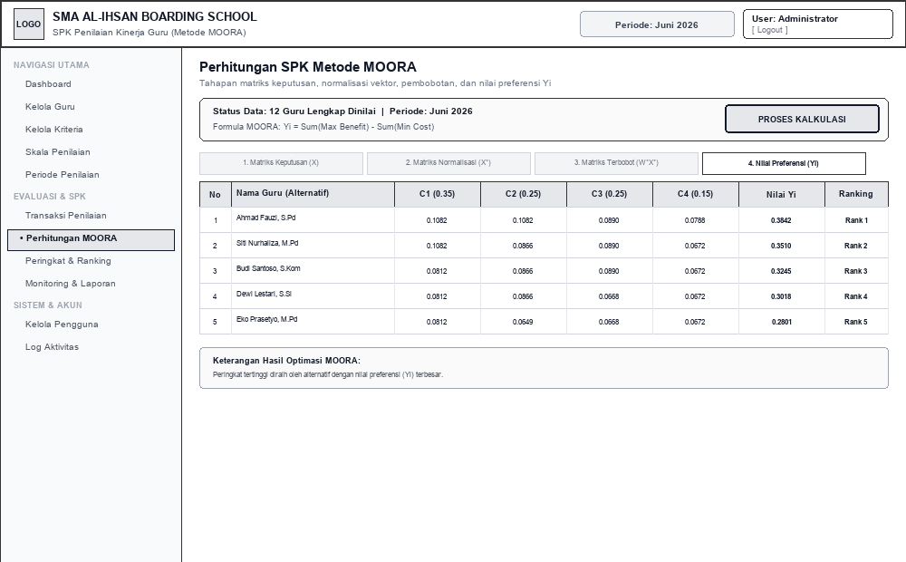

**Gambar 4.8. Rancangan Antarmuka Proses Perhitungan SPK MOORA**

| No | Nama Kontrol / Komponen | Tipe Kontrol | Fungsi / Keterangan |
| :---: | :--- | :---: | :--- |
| 1 | **Status Validasi Data Guru** | `Status Badge Box` | Menampilkan indikator kesiapan kelengkapan data nilai seluruh guru aktif |
| 2 | **Tombol [PROSES KALKULASI]** | `Primary Action Button` | Menjalankan kalkulasi matematis SPK metode MOORA secara otomatis |
| 3 | **Tab Selektor Matriks** | `Tab Navigation` | Pilihan tampilan: 1. Matriks X, 2. Matriks X*, 3. Matriks W*X*, 4. Nilai Yi |
| 4 | **Tabel Matriks MOORA** | `Data Table Grid` | Menampilkan nilai kalkulasi numerik per kriteria untuk setiap guru alternatif |
| 5 | **Ringkasan Hasil Optimasi** | `Summary Card` | Menampilkan penjelasan nilai preferensi Yi dan formula max-min MOORA |

---

### 4.4.9 Rancangan Antarmuka Peringkat & Hasil Ranking Guru

Halaman Ranking Guru berfungsi untuk menyajikan hasil akhir perankingan kelayakan kinerja guru yang telah diurutkan dari nilai preferensi Yi tertinggi hingga terendah, dilengkapi visualisasi podium 3 besar guru terbaik. **Hak Akses**: `Administrator, Kepala Sekolah`.

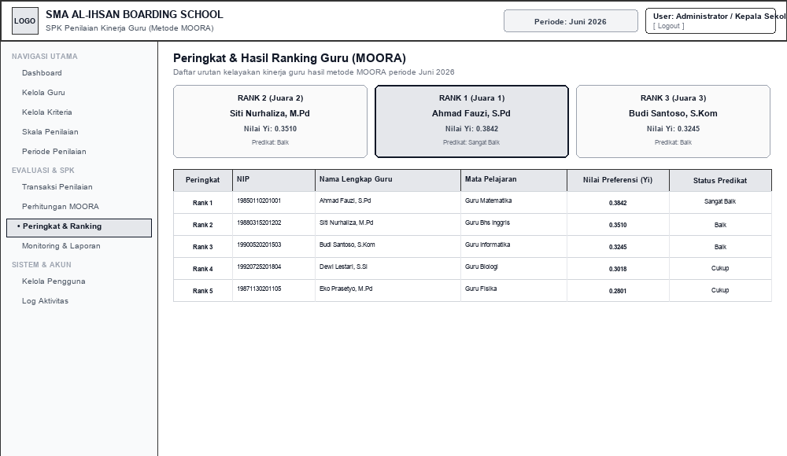

**Gambar 4.9. Rancangan Antarmuka Peringkat & Hasil Ranking Guru**

| No | Nama Kontrol / Komponen | Tipe Kontrol | Fungsi / Keterangan |
| :---: | :--- | :---: | :--- |
| 1 | **Podium Top 3 Terbaik** | `Podium Display Widget` | Menampilkan kartu visual Juara 1, Juara 2, dan Juara 3 beserta skor Yi |
| 2 | **Tabel Peringkat Lengkap** | `Data Table Grid` | Menampilkan kolom Peringkat (Rank 1..N), NIP, Nama, Mapel, Nilai Yi, Predikat |
| 3 | **Badge Predikat Kinerja** | `Status Badge` | Label kategori capaian kinerja (Sangat Baik, Baik, Cukup, Kurang) |

---

### 4.4.10 Rancangan Antarmuka Laporan & Cetak Rekapitulasi

Halaman Laporan berfungsi untuk mencetak dan mengekspor rekapitulasi komprehensif hasil evaluasi penilaian kinerja guru dan perankingan MOORA ke dalam format dokumen resmi PDF (siap tanda tangan) dan file spreadsheet Microsoft Excel. **Hak Akses**: `Administrator, Kepala Sekolah`.

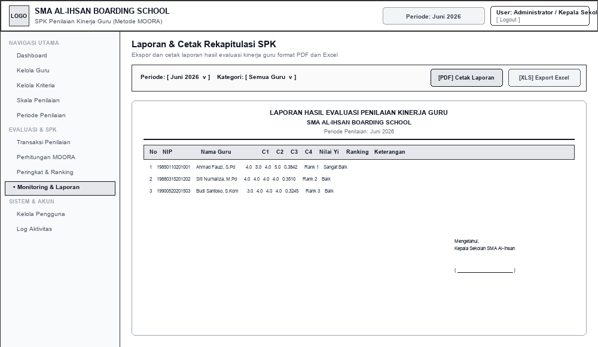

**Gambar 4.10. Rancangan Antarmuka Laporan & Cetak Rekapitulasi**

| No | Nama Kontrol / Komponen | Tipe Kontrol | Fungsi / Keterangan |
| :---: | :--- | :---: | :--- |
| 1 | **Filter Periode & Kategori** | `Dropdown Filter` | Menyaring laporan berdasarkan periode evaluasi dan kategori guru |
| 2 | **Tombol [Cetak Laporan PDF]** | `Action Button` | Menghasilkan format cetak dokumen resmi PDF lengkap dengan lembar pengesahan |
| 3 | **Tombol [Export Excel]** | `Action Button` | Mengunduh rekapitulasi data penilaian dalam format spreadsheet (.xlsx) |
| 4 | **Lembar Pratinjau Dokumen** | `Document Preview Box` | Pratinjau tampilan tabel rekapitulasi nilai C1-C4, ranking, dan kolom tanda tangan |

---

### 4.4.11 Rancangan Antarmuka Kelola Akun Pengguna / User

Halaman Kelola Pengguna berfungsi untuk mengatur data akun login sistem, menetapkan tingkat hak akses (Role ADMIN, KEPALA_SEKOLAH, atau GURU), menghubungkan akun guru dengan data master guru, serta melakukan reset password. **Hak Akses**: `Administrator`.

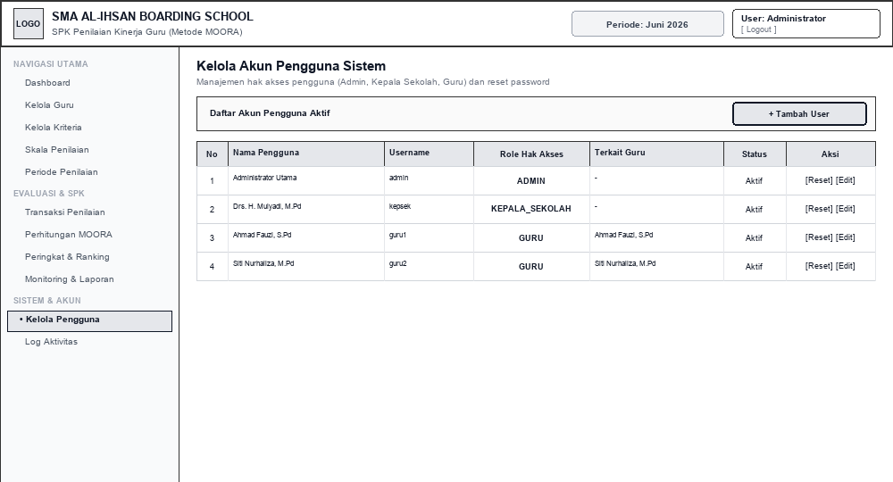

**Gambar 4.11. Rancangan Antarmuka Kelola Akun Pengguna / User**

| No | Nama Kontrol / Komponen | Tipe Kontrol | Fungsi / Keterangan |
| :---: | :--- | :---: | :--- |
| 1 | **Tombol + Tambah User** | `Primary Button` | Membuka form pembuatan akun kredensial pengguna baru |
| 2 | **Tabel Akun Pengguna** | `Data Table Grid` | Menampilkan Nama Pengguna, Username, Hak Akses (Role), Relasi Guru, Status |
| 3 | **Tombol [Reset Password]** | `Action Link` | Mereset password pengguna ke kata sandi standar secara instan |
| 4 | **Tombol [Edit Akun]** | `Action Link` | Memodifikasi hak akses atau menonaktifkan akun pengguna |

---

### 4.4.12 Rancangan Antarmuka Dashboard & Profil Mandiri Guru

Halaman Dashboard Guru berfungsi sebagai portal mandiri bagi tenaga pendidik (guru) untuk melihat biodata profil dinas, beban jam tatap muka, rincian skor capaian kriteria evaluasi (C1-C4), peringkat kinerja mandiri, serta catatan evaluasi dari Kepala Sekolah. **Hak Akses**: `Guru (Tenaga Pendidik)`.

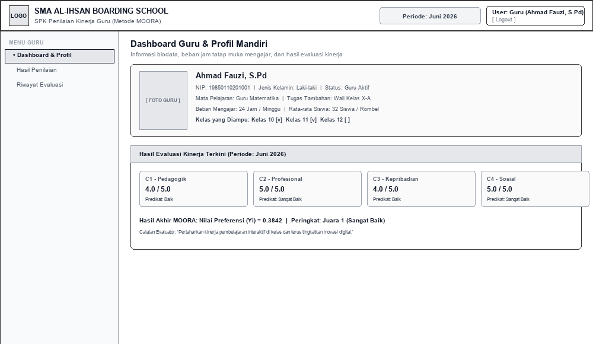

**Gambar 4.12. Rancangan Antarmuka Dashboard & Profil Mandiri Guru**

| No | Nama Kontrol / Komponen | Tipe Kontrol | Fungsi / Keterangan |
| :---: | :--- | :---: | :--- |
| 1 | **Kartu Profil & Beban Kerja** | `Biodata Card` | Menampilkan NIP, Nama, Mapel, Tugas Tambahan, Jam Ajar, dan Kelas yang Diampu |
| 2 | **4 Widget Capaian Kriteria** | `Score Badge Cards` | Menampilkan nilai skor perolehan C1, C2, C3, dan C4 beserta predikat capaian |
| 3 | **Kotak Hasil Akhir MOORA** | `Result Summary Card` | Menampilkan nilai preferensi Yi yang diperoleh dan posisi peringkat guru |
| 4 | **Catatan Evaluasi Kepala Sekolah** | `Feedback Box` | Menampilkan pesan umpan balik kualitatif dan saran peningkatan kinerja |

---

